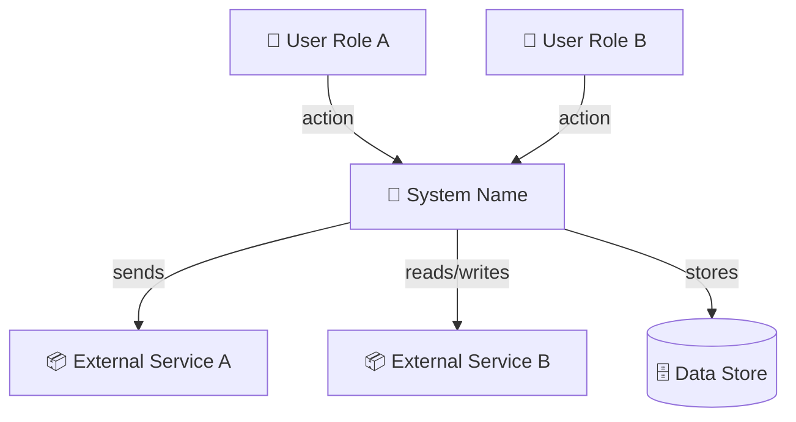
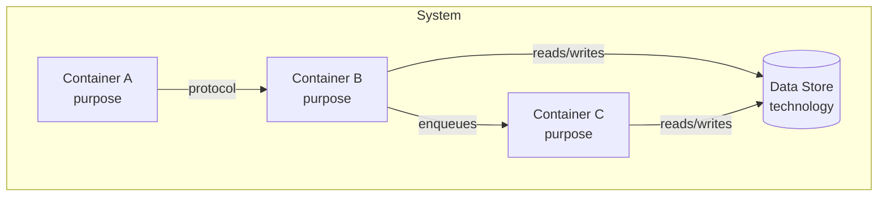
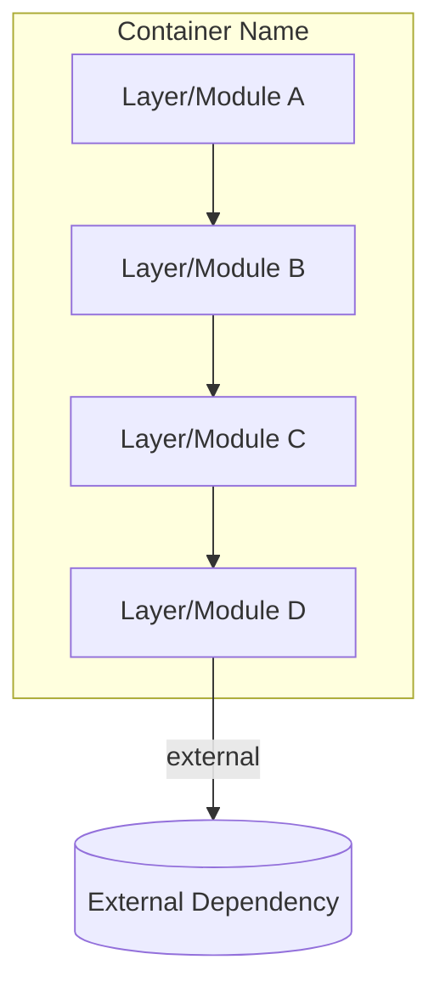
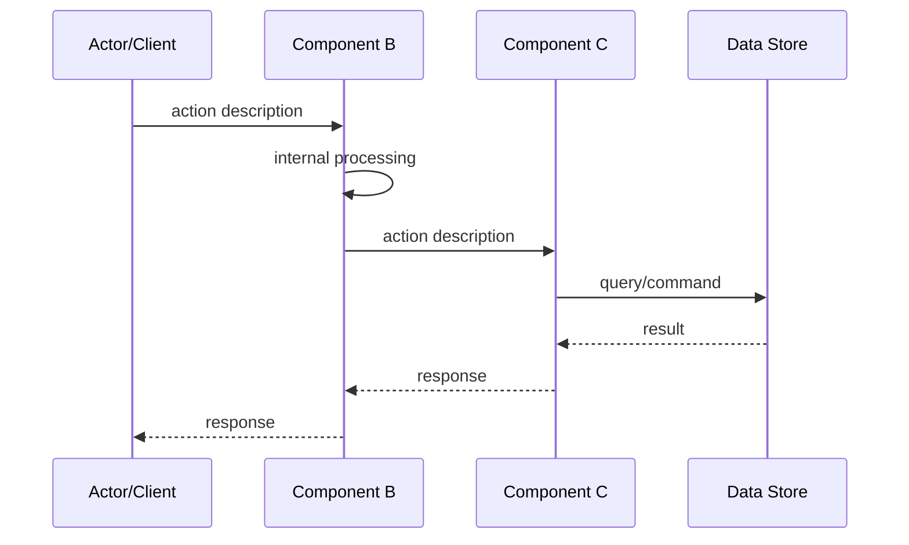
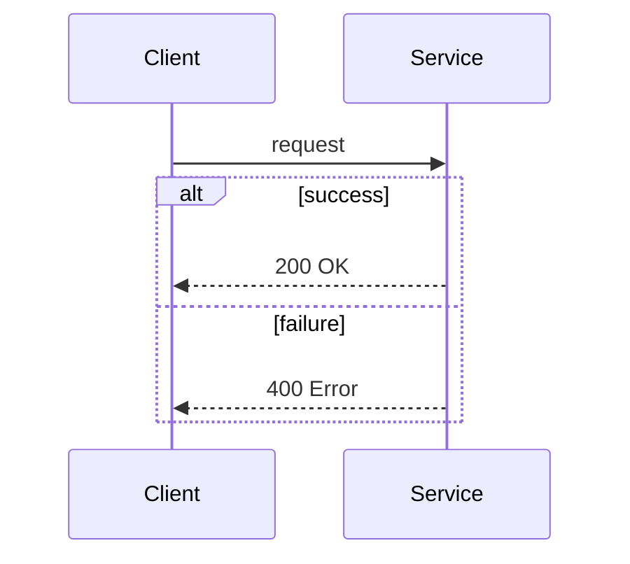
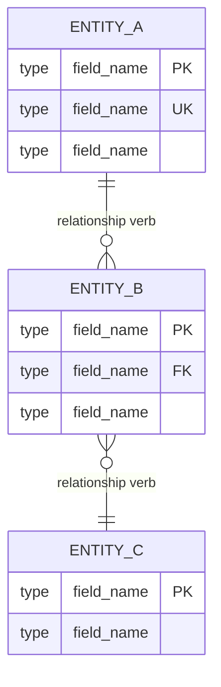
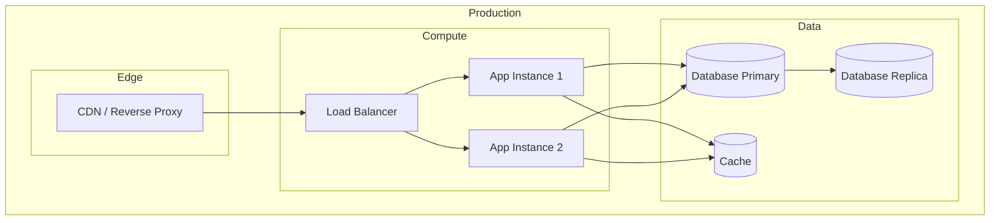

# Mermaid Diagram Patterns

Structural patterns for architecture diagrams. Replace placeholder content with actual data inferred from the codebase.

Only generate the diagrams supported by repository evidence. If a diagram would be speculative, omit it and explain why.

## Contents

- [Diagram Selection Guide](#diagram-selection-guide)
- [System Context Diagram (C4 Level 1)](#system-context-diagram)
- [Container Diagram (C4 Level 2)](#container-diagram)
- [Component Diagram (C4 Level 3)](#component-diagram)
- [Sequence Diagram](#sequence-diagram)
- [ER Diagram](#er-diagram)
- [Deployment Diagram](#deployment-diagram)

---

## Diagram Selection Guide

Select diagrams based on project complexity:

| Complexity  | Characteristics                                              | Diagrams to generate                                 |
| ----------- | ------------------------------------------------------------ | ---------------------------------------------------- |
| **Simple**  | Single service, one data store                               | Component + 1-2 sequences                            |
| **Medium**  | Multiple layers (frontend + API + DB), external integrations | Context + container + component + key sequences + ER |
| **Complex** | Multiple services, async communication, distributed data     | All of the above + deployment + data flow            |

Always generate at least a **component diagram** and one **sequence diagram** for the most critical flow.

If the project is simple, omit system context, container, or deployment diagrams unless the repository clearly supports them.

---

## System Context Diagram

Shows the system as a box surrounded by its users and external systems. Use for medium+ complexity.

**Guidelines:**

- The system is one box — don't show internals here
- Show all user roles that interact with the system
- Show all external systems, services, and data stores
- Label edges with the action or data exchanged
- Do not add actors or external systems that are not evidenced by config, code, docs, or integrations in the repository

---

## Container Diagram

Shows the major deployable/runnable units inside the system and how they communicate. Use for medium+ complexity.

**Guidelines:**

- Each container is a separately deployable unit (app, service, database, queue, cache)
- Label with both name and purpose/technology
- Show communication protocols on edges (HTTP, gRPC, SQL, async, etc.)
- Use `[( )]` for databases/stores, `[ ]` for services
- Only model separately deployable/runtime units that are clearly observable in the repository

---

## Component Diagram

Shows internal modules/layers within a container. Use for all project sizes.

**Guidelines:**

- Show the major internal modules, layers, or packages
- Reflect the actual directory/module structure of the code
- Show data flow direction with arrows
- Group related modules in subgraphs when helpful
- Prefer real module names over generic labels whenever the repository structure makes them clear

---

## Sequence Diagram

Shows the step-by-step interaction for a critical flow. Generate at least one for the most important operation.

**Guidelines:**

- Focus on critical flows: authentication, main business operation, data processing pipeline
- Use `->>`for requests and `-->>` for responses
- Show internal processing with self-arrows when important
- Keep participants to 4-6 maximum for readability
- Use `alt`/`opt`/`loop` fragments for conditional or repeated logic:
- Keep the sequence aligned with actual handlers, services, jobs, or modules visible in the repository

---

## ER Diagram

Shows entity relationships for the data model. Use when the project has persistent data.

**Cardinality notation:**

- `||--||` — one to one
- `||--o{` — one to many
- `}o--o{` — many to many
- `o` = optional (zero or more), `|` = mandatory (one or more)

**Guidelines:**

- Include PK, FK, and UK constraints
- Use field types as they appear in the codebase (uuid, string, int, timestamp, etc.)
- Label relationships with a verb that describes the business meaning
- Infer from schema files, migration files, or ORM model definitions
- Mark uncertain relationships as needing confirmation rather than inventing missing cardinality

---

## Deployment Diagram

Shows infrastructure and environment layout. Use for complex projects or those with non-trivial deployment.

**Guidelines:**

- Use subgraphs for environment boundaries (production, staging)
- Use subgraphs for infrastructure layers (edge, compute, data)
- Infer from Dockerfiles, docker-compose, CI/CD configs, cloud configs
- Show replication, load balancing, and caching when present
- Keep labels generic — use roles (Database, Cache) not brand names unless the project explicitly uses them
- Omit the deployment diagram when infrastructure layout cannot be supported from repository evidence
